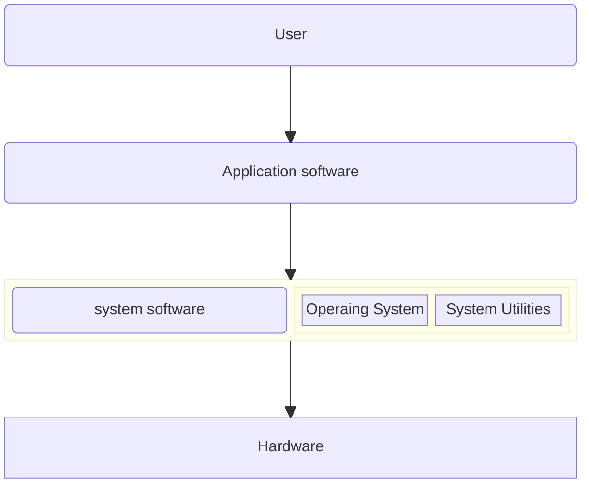
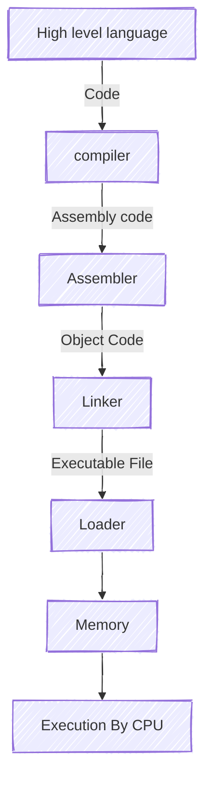

# Introduction
### Systems programming refers to the development of software that provides services to other softwares or interacts closely with the hardware. It invloves creating programs that manage and control system resources like memory, peripheral devices and processors. These programs acts as an bridge between hardware and user applications.

### Unlike application programming which is focused on solving user level problems, Systems programming deals with:
- Operating systems (linux, windows, ios)
- Sevice drivers
- Compilers
- Assemblers
- Linkers and Loaders
- System Utilities (file management tools, etc)

### Features of Systems Programming
|Feature                    |Description                                                    |
|:--------------------------|:--------------------------------------------------------------|
|Low level access           |Directly manages hardware resources                            |
|Efficiency                 |Optimized for speed and memory usage                           |
|Portability                |Often designed to work across platforms with minimal changes   |
|Close to OS/Kernel         |Interacts closely with the operating system or kernel          |
|Use of low level languages |Primarily written in C, C++ or Assembly                        |

### Need of systems programming:
1. Hardware control
2. OS development
3. Performance
4. Resource Management
5. Foundation for application programming
6. Customization and security

### Software Hirarchy

### Types of softwares
- ### System Software
---
    A System software is a type of software created to provide services to other programs. It acts as a bridge between the application software and hardware. It controls and manages the hardware and provides an environment for the application softwares to run.

    Examples:
        1. Operating systems
        2. Compilers
        3. Assemblers
        4. Linkers and Loaders
        5. Device Drivers
        6. BIOS Firmware

    Functions:
        1. Managing Hardware
        2. Managing System Resources
        3. Providing an environment for the application programs to run
        4. File System Management
        5. Providing Security and Access Control

- ### Application Software
 ---
    A Application Software is a User level program, that is created to perform specific tasks or solve problems for the User. It runs on top of the System Softwares. It interacts directly with the user. All the interactions between the application softwares and hardware is managed by the system softwares.

    Examples:
        1. Web Browser
        2. Word Document
        3. Video Games
        4. Social Media Applications
        5. Communication Applications 
        6. E-commerce Applications

    Functions:
        1. Solving specific problems
        2. Providing UI
        3. Utilizing System Software to access hardware indirectly

### Comparison Table
---
|Feature    | System Software           | Application Software          |
|:---------:|:-------------------------:|:-----------------------------:|
|Purpose    |Managing System resources  |Solving User specific problems |
|Runs on    |Hardware                   |System Software                |
|Users      |Mostly hidden from users   |Directly used by end users     |
|Examples   |Operating Systems,compilers|web browsers, games            |
|Dependency |Independent                |Dependent on system software   |

### Machine Structure
---
    Machine Structure refers to the internal architecture of a computer system, incluing hardware components and how software interacts with them at the low level. It provides the foundation for writing low level programs like compilers, assemblers, linkers, loaders and operating systems.

#### Components
---    
1. Memory Organization:
    - Ram
    - Stack
    - Heap
    - Registers
2. Instruction Set Srchitecture:
    - Set of instructions a processor can understand
    - like mov, add, sub, jmp, etc
3. I/O Organization:
    - I/O devices interface using system buses and interrupts
    - I/O handeled via polling, interrupts and DMA
4. System Buses:
    - Data Bus: transfers actual data
    - Address Bus: carries memory addresses
    - Control Bus: sends the control signals
5. Modes of Operations:
    - User mode: limited access, runs application
    - Kernel mode: full hardware access, runs OS Services

