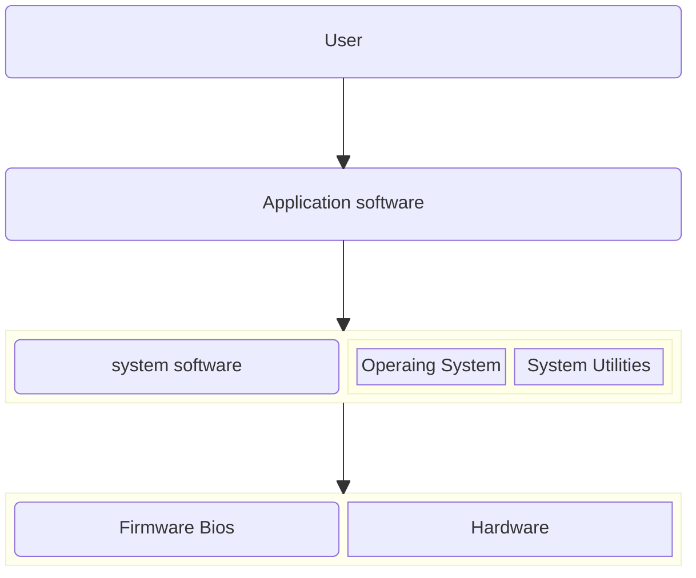

# Introduction
### Systems programming refers to the development of software that provides services to other softwares or interacts closely with the hardware. It invloves creating programs that manage and control system resources like memory, peripheral devices and processors. These programs acts as an bridge between hardware and user applications.
<!-- Systems programming refers to the development of the software that provides services to other software or interacts closely with the hardware. It involves creating programs that manage and control the system resources like memory, processors and peripheral devices. These programs acts like a bridge between the hardware and user applications. -->
<!-- Systems programming refers to the development of the software that provides services to other software or interacts closely with the hardware. It involves creating programs that manage and control the system resources like memory, processors and peripheral devices. These programs acts like a bridge between the user applications and hardware. -->
<!-- Systems programming refers to the development of the software that provides services to other software or interacts closely with the hardware. It involves creating programs that manage and control the system resources like memory, processors and peripheral devices. These programs acts like a bridge between the user applications and hardware. -->

### Unlike application programming which is focused on solving user level problems, Systems programming deals with:
- Operating systems (linux, windows, ios)
- Sevice drivers
- Compilers
- Assemblers
- Linkers and Loaders
- System Utilities (file management tools, etc)

### Features of Systems Programming
|Feature                    |Description                                                    |
|:--------------------------|:--------------------------------------------------------------|
|Low level access           |Directly manages hardware resources                            |
|Efficiency                 |Optimized for speed and memory usage                           |
|Portability                |Often designed to work across platforms with minimal changes   |
|Close to OS/Kernel         |Interacts closely with the operating system or kernel          |
|Use of low level languages |Primarily written in C, C++ or Assembly                        |

<!-- os, compilers, linkers and loaders, assemblers, system utilities, device deivers -->
<!-- low level access, efficiency, use of low level languages, portability, close to os/kernel -->

### Need of systems programming:
1. Hardware control
2. OS development
3. Performance
4. Resource Management
5. Foundation for application programming
6. Customization and security

### Software Hirarchy
